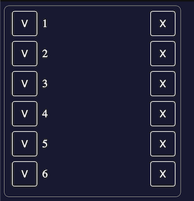

# A Fullstack App Demo

This should serve as demo for a classic Server + Client app with `Express` as a server and `React` as the UI Library

## Installation  

```
git clone git@github.com:hesher/FullStackDemo.git
cd FullStackDemo
yarn
```


## Running
- `yarn dev`: Start express server + static client server. Allow hot reloading
- `yarn start`: bundle client into bundle.js and server from express server

